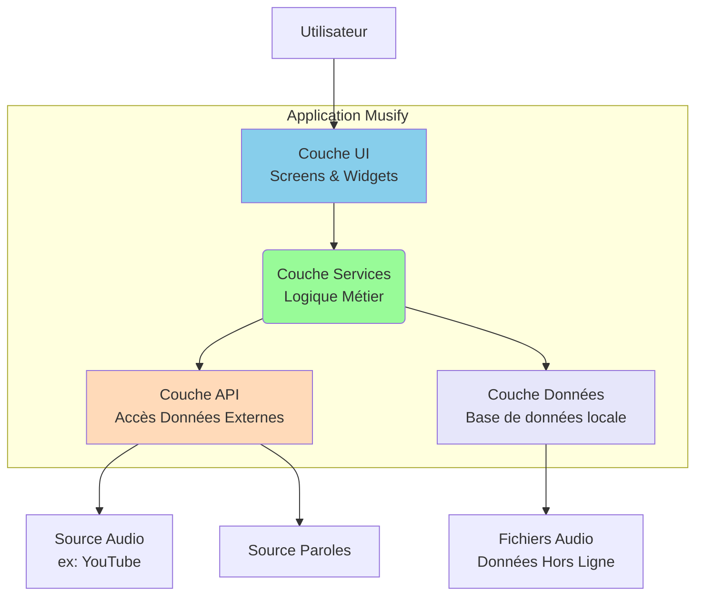
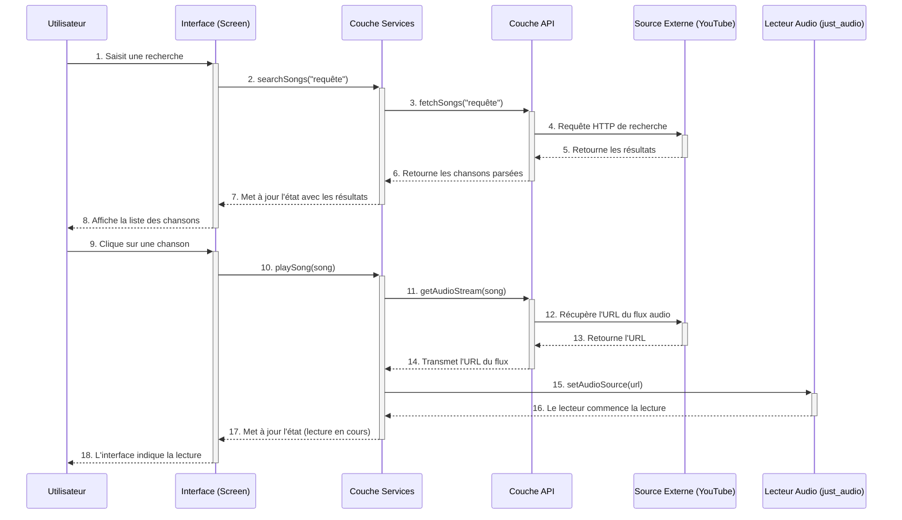

# 2. Architecture de l'Application

L'architecture de Musify est modulaire, séparant clairement l'interface utilisateur (UI), la logique métier (Services) et l'accès aux données (API, DB).

## Diagramme des Composants

Ce diagramme illustre la structure générale et les interactions entre les principaux modules.

*   **Couche UI** (`lib/screens`, `lib/widgets`): Responsable de l'affichage. Elle est construite en Flutter et ne contient aucune logique métier complexe.
*   **Couche Services** (`lib/services`): Le cœur de l'application. Elle orchestre les actions, traite les données et fait le lien entre l'UI et les sources de données.
*   **Couche API** (`lib/API`): Gère la communication avec les services externes (recherche, streaming, paroles).
*   **Couche Données** (`lib/DB`): Gère la persistance des données sur l'appareil (playlists, paramètres) avec la base de données Hive.

## Flux de Données : Recherche et Lecture d'une Chanson

Ce diagramme de séquence montre les étapes détaillées lorsqu'un utilisateur recherche et lance une chanson.

