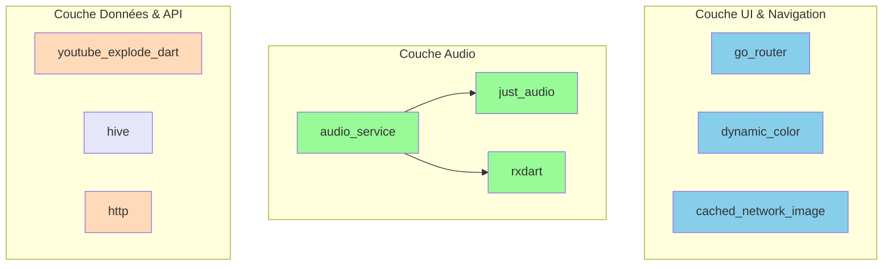

# 4. Dépendances Principales

Musify s'appuie sur un écosystème de bibliothèques open-source robustes pour fournir ses fonctionnalités. Voici les plus importantes :

## Diagramme des Dépendances Clés

Ce diagramme montre comment les principales dépendances s'intègrent dans les différentes couches de l'application.

## Description des Dépendances

| Bibliothèque             | Rôle                                                                                                | Couche        |
| ------------------------ | --------------------------------------------------------------------------------------------------- | ------------- |
| **`go_router`**          | Gère la navigation et les URL au sein de l'application de manière déclarative.                      | UI            |
| **`just_audio`**         | Un lecteur audio puissant et hautement personnalisable pour la lecture des flux.                    | Audio         |
| **`audio_service`**      | Permet à `just_audio` de fonctionner en arrière-plan et de s'intégrer avec le système d'exploitation (notifications, contrôles de l'écran de verrouillage). | Audio         |
| **`youtube_explode_dart`** | La dépendance la plus critique. Elle fournit les outils pour extraire les métadonnées et les URL de flux audio directement depuis YouTube sans utiliser leur API officielle. | API           |
| **`hive` / `hive_flutter`** | Une base de données NoSQL "clé-valeur" extrêmement rapide, utilisée pour tout le stockage local (playlists, cache, paramètres). | Données       |
| **`rxdart`**             | Fournit des classes et des opérateurs de programmation réactive (Streams), essentiels pour gérer les états complexes des flux audio. | Audio         |
| **`dynamic_color`**      | Implémente le theming dynamique "Material You" en extrayant les couleurs du fond d'écran de l'utilisateur (Android 12+). | UI            |
| **`cached_network_image`** | Télécharge et met en cache les images (pochettes d'album) pour une meilleure performance et une utilisation réduite des données. | UI            |
| **`http`**               | Un client HTTP standard pour effectuer des requêtes réseau de base (par exemple, pour les paroles). | API           |
