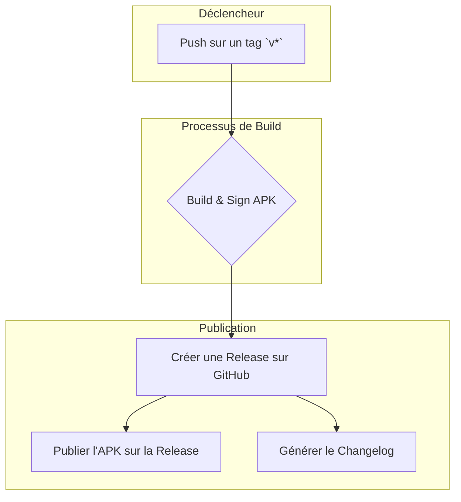

# 5. Workflows et CI/CD

Le projet utilise **GitHub Actions** pour l'intégration et le déploiement continus (CI/CD). Les workflows sont définis dans des fichiers `.yml` situés dans le dossier `.github/workflows/`.

## Diagramme du Workflow de Release

## Description des Workflows

*   **`release.yml`**:
    *   **Déclencheur**: Création d'un nouveau tag (ex: `v9.7.0`).
    *   **Actions**: Ce workflow est le plus important. Il prend en charge la construction de l'APK signé pour la production, la création d'une nouvelle "Release" sur GitHub, et l'upload de l'artefact (le fichier APK) pour que les utilisateurs puissent le télécharger.

*   **`fdroid.yml`**:
    *   **Déclencheur**: Push sur la branche `master`.
    *   **Actions**: Prépare les métadonnées nécessaires pour la publication sur F-Droid, un magasin d'applications alternatif axé sur les logiciels libres. Ce workflow s'assure que la structure des fichiers est correcte pour le processus de build de F-Droid.

*   **`debug.yml`**:
    *   **Déclencheur**: Push sur n'importe quelle branche (sauf `master`).
    *   **Actions**: Construit une version de débogage de l'application. C'est utile pour tester rapidement les modifications sur un appareil réel sans avoir à configurer un environnement de build local complet. L'APK de débogage est disponible en tant qu'artefact du workflow.

*   **`pre_release.yml` / `pre_beta.yml` / `pre_fdroid.yml`**:
    *   **Déclencheur**: Manuel (via l'interface de GitHub Actions).
    *   **Actions**: Ces workflows servent à préparer et valider les versions préliminaires avant une publication officielle. Ils permettent de tester les processus de build de `release` et `fdroid` dans un environnement contrôlé.
