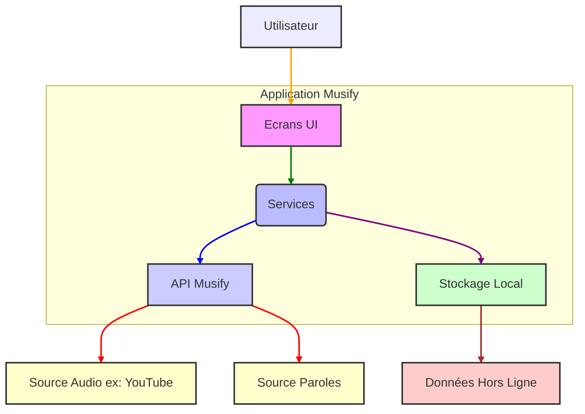

# Architecture de l'Application Musify

Ce diagramme de composants illustre l'architecture générale de l'application Musify, en mettant en évidence les interactions entre ses principaux modules et les entités externes.

## Explication des Composants :

*   **Utilisateur** : L'acteur principal qui interagit avec l'application.
*   **Ecrans UI** : Représente l'interface utilisateur de l'application (par exemple, `home_page`, `search_page`, `now_playing_page`). C'est par ici que l'utilisateur navigue et initie des actions.
*   **Services** : Le cœur de la logique métier de l'application. Ces services (comme `audio_service`, `data_manager`, `lyrics_manager`, `playlist_download_service`, `settings_manager`) gèrent les opérations complexes, la gestion des données, la lecture audio, etc. Ils agissent comme un intermédiaire entre l'UI et les sources de données.
*   **API Musify** : Gère les communications avec les sources de données externes, comme la recherche de chansons, la récupération de métadonnées ou l'accès aux flux audio. Le fichier `musify.dart` dans `lib/API` est probablement responsable de cette interaction.
*   **Stockage Local** : Utilisé pour persister les données de l'application sur l'appareil de l'utilisateur. Cela inclut les paramètres, les playlists hors ligne et les données mises en cache. Le `data_manager.dart` et `io_service.dart` gèrent probablement cet aspect.
*   **Source Audio (ex: YouTube)** : La source externe d'où proviennent les flux audio. Musify peut extraire l'audio directement à partir d'URL YouTube.
*   **Source Paroles** : Une source externe pour récupérer les paroles des chansons.
*   **Données Hors Ligne** : Les données (chansons, playlists) qui sont stockées localement pour permettre une écoute sans connexion internet.

## Flux d'Interaction Typique :

1.  L'**Utilisateur** interagit avec les **Ecrans UI** pour rechercher une chanson ou accéder à une playlist.
2.  Les **Ecrans UI** appellent les **Services** pertinents pour effectuer l'action demandée (par exemple, `search_page` appelle un service de recherche).
3.  Les **Services** peuvent :
    *   Interagir avec l'**API Musify** pour récupérer des données en ligne (recherche de chansons, métadonnées).
    *   Interagir avec le **Stockage Local** pour lire ou écrire des données (playlists, paramètres, données hors ligne).
4.  L'**API Musify** communique avec des **Sources Audio** (comme YouTube) pour obtenir les flux audio et des **Sources Paroles** pour les paroles.
5.  Les données récupérées sont traitées par les **Services** et renvoyées aux **Ecrans UI** pour être affichées à l'**Utilisateur**.
6.  Les **Services** peuvent également gérer le téléchargement de **Données Hors Ligne** vers le **Stockage Local** pour une écoute ultérieure.